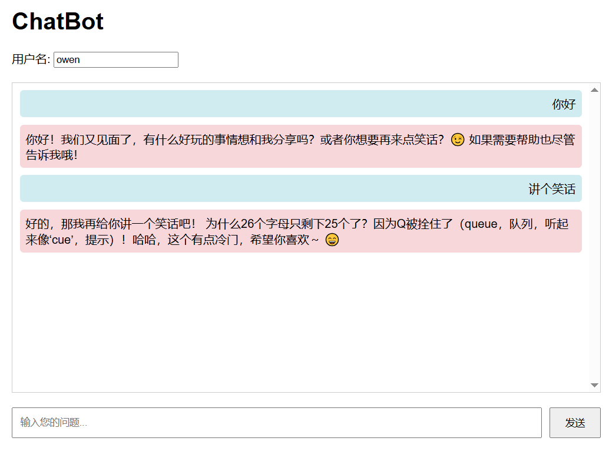

# agentsocpe-fastapi

## 项目背景

本项目是一个基于 AgentScope 和 FastAPI 构建的聊天机器人应用。AgentScope 是阿里巴巴开源的一套多智能体开发框架，提供了构建 LLM 应用的标准化流程和工具集。该项目旨在展示如何利用 AgentScope 快速搭建一个具有流式传输能力的聊天机器人服务，并通过 FastAPI 提供 RESTful API 接口。

该应用支持实时对话功能，用户可以通过前端界面与基于大语言模型的聊天机器人进行交互。后端采用 Server-Sent Events (SSE) 技术实现流式响应，使用户能够实时看到机器人的逐步回复，提供更自然的对话体验。



## 关键技术挑战

### 1. 实时流式传输
实现从后端模型到前端界面的实时数据传输是一项关键技术挑战。传统的 HTTP 请求-响应模式无法满足实时显示生成内容的需求。

### 2. 多用户会话管理
在多用户并发访问场景下，需要有效管理每个用户的独立会话状态，确保对话上下文不会混乱。

### 3. 前后端异步通信
前端需要以非阻塞方式接收后端逐步生成的内容，并实时更新界面，这对异步处理机制提出了较高要求。

### 4. 用户体验优化
需要处理各种边界情况，如网络中断、重复请求、输入验证等，以保证良好的用户体验。

## 解决方案

### 1. SSE 流式传输技术
采用 Server-Sent Events (SSE) 实现从服务端向客户端的单向实时数据推送。相比 WebSocket 更加轻量级，适合聊天机器人这种主要是服务端向客户端推送数据的场景。

### 2. AgentScope 会话管理
利用 AgentScope 内置的会话管理机制，为每个用户维护独立的对话历史记录。通过用户名标识不同用户，确保对话上下文隔离。

### 3. FastAPI 异步支持
基于 FastAPI 的异步特性，实现高并发处理能力。使用 StreamingResponse 返回流式数据，配合 AgentScope 的生成器模式，实现端到端的异步处理。

### 4. 前端状态管理
前端通过 JavaScript 实现详细的状态管理，包括：
- 用户名输入控制
- 消息发送状态跟踪
- 实时滚动更新聊天窗口
- 错误处理和连接状态监控

### 5. 用户体验优化措施
- 实时禁用/启用输入控件防止重复提交
- 自动滚动聊天窗口确保最新消息可见
- 优雅处理连接异常和中断情况
- 支持 Enter 键快速发送消息

## 项目结构

```
agentscope-fastapi/
├── chatbot.py              # 后端主程序，基于 FastAPI 实现 SSE 流式接口
├── front.html              # 前端界面，使用 HTML/CSS/JavaScript 实现
├── clibot.py               # 命令行版本的聊天机器人
├── requirements.txt        # 项目依赖包列表
├── sessions/               # 会话数据存储目录
└── README.md              # 项目说明文档
```

## 快速开始

### 环境要求

- Python 3.8+
- pip 包管理器

### 安装步骤

1. 克隆或下载项目代码

2. 安装依赖：
```bash
pip install -r requirements.txt
```

3. 配置环境变量：
需要设置 `API_KEY` 环境变量，用于访问大语言模型 API：
```bash
export API_KEY=your_api_key_here
```

4. 运行后端服务：
```bash
python chatbot.py
```

服务默认运行在 `http://localhost:8000`

5. 打开前端界面：
在浏览器中打开 [front.html](file://c:\Users\owen\Documents\VsCode\agentsocpe-fastapi\front.html) 文件，或访问 `http://localhost:8000`

## API 接口说明

### 流式聊天接口

```
GET /stream
```

该接口使用 Server-Sent Events (SSE) 技术实现实时流式传输。

**参数：**
- `username` (string, required): 用户名，用于标识不同的会话
- `query` (string, required): 用户的聊天消息

**响应：**
- Content-Type: text/event-stream
- 返回 Server-Sent Events 格式的流式数据

**示例请求：**
```bash
curl "http://localhost:8000/stream?username=Alice&query=你好"
```

**响应格式：**
```
data: {"message": "你"}
data: {"message": "你好"}
data: {"message": "你好！"}
data: {"message": "你好！有什么"}
data: {"message": "你好！有什么我可以"}
data: {"message": "你好！有什么我可以帮助"}
data: {"message": "你好！有什么我可以帮助你的"}
data: {"message": "你好！有什么我可以帮助你的吗？"}

```

每个 `data` 行代表模型生成过程中的一个片段，前端通过 SSE 实时接收并展示这些片段。

### 健康检查接口

```
GET /docs
```

FastAPI 自动生成的 API 文档界面，可以查看所有可用接口并进行测试。

## 使用说明

1. 在前端界面的用户名输入框中输入您的昵称
2. 在消息输入框中输入您想与聊天机器人交流的内容
3. 点击"发送"按钮或按回车键发送消息
4. 实时查看聊天机器人的回复

注意：当切换用户名时，聊天记录会自动清空，确保每个用户都有独立的聊天环境。